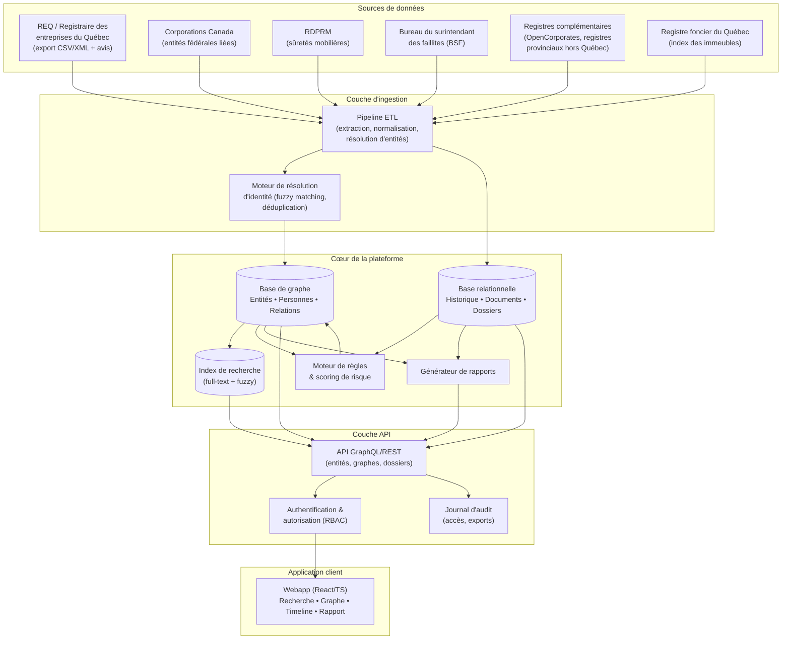

# VéloceREQ — Architecture fonctionnelle

## 1. Vue d'ensemble

## 2. Couches détaillées

### 2.1 Sources de données

| Source | Contenu | Fréquence de mise à jour | Statut |
|---|---|---|---|
| REQ (données ouvertes + service Rechercher une entreprise) | NEQ, nom, statut, forme juridique, administrateurs, actionnaires ≥10 %, adresses, avis de modification | Quotidienne (export officiel) | Primaire |
| Registre des bénéficiaires ultimes (volet LPLE 2023) | Personnes physiques exerçant un contrôle | Quotidienne | Primaire |
| Corporations Canada (LCSA) | Entités fédérales avec activités au Québec | Hebdomadaire | Complémentaire |
| RDPRM | Sûretés, hypothèques mobilières — indices de nantissement d'actifs | Hebdomadaire | Complémentaire, corrobore transferts d'actifs |
| BSF (faillites/propositions) | Procédures d'insolvabilité liées à une entité/personne | Hebdomadaire | Complémentaire, critique pour syndics |
| Registre foncier du Québec | Transferts immobiliers par une entité | À la demande (coût par recherche) | Complémentaire, sur activation dossier |
| Presse d'affaires / avis légaux publics | Contexte narratif (fusions, litiges) | À la demande | Enrichissement contextuel |

**Principe** : toute donnée non issue directement du REQ est visuellement distinguée (badge de source) — on ne mélange jamais silencieusement du déclaratif officiel avec de l'indice corroborant.

### 2.2 Ingestion & résolution d'entités

- **ETL** : normalisation des adresses (format Poste Canada), des noms (majuscules/accents/abréviations juridiques : inc., ltée, s.e.n.c.), horodatage de chaque avis avec son numéro officiel.
- **Résolution d'identité** : une personne nommée « Jean R. Tremblay » sur une fiche et « Jean-Réal Tremblay » sur une autre est-elle la même personne ? Le moteur de résolution combine :
  - Similarité de nom (Jaro-Winkler + phonétique française/anglaise),
  - Recoupement d'adresse résidentielle déclarée,
  - Recoupement temporel (chevauchement de mandats),
  - Recoupement de co-signataires (mêmes cosignataires récurrents renforcent la confiance).
  - Le résultat n'est **jamais fusionné automatiquement en silence** au-delà d'un seuil de confiance : sous un seuil, deux fiches restent distinctes mais liées par un lien « possible même personne — à confirmer », affiché à l'utilisateur avec le score de confiance.

### 2.3 Cœur de plateforme

- **Base de graphe** (type Neo4j / Amazon Neptune) : nœuds = Entité, Personne, Adresse ; arêtes = ADMINISTRE, DÉTIENT(%), A_POUR_ADRESSE, SUCCÈDE_À, LIÉ_À(type). C'est le moteur de la cartographie relationnelle et de la détection de cascades (traversée de graphe).
- **Base relationnelle** (PostgreSQL) : historique versionné, documents/avis sources, dossiers d'audit, annotations, utilisateurs, permissions. Voir modèle de données détaillé (doc 05).
- **Index de recherche** (OpenSearch/Elasticsearch) : recherche full-text + fuzzy sur noms, adresses, NEQ.
- **Moteur de règles & scoring** : évalue chaque entité/groupe contre une bibliothèque de règles de détection (doc 04), produit un score et alimente des attributs sur les nœuds du graphe (consommés ensuite par l'UI).
- **Générateur de rapports** : compose un document (PDF/Word) à partir d'un état de dossier (graphe figé + annotations + sources), avec mise en page professionnelle et annexes graphiques.

### 2.4 API

- **API-first** : toute fonctionnalité de l'UI passe par une API GraphQL (requêtes flexibles sur graphes imbriqués) doublée d'endpoints REST pour les opérations simples (recherche, export). Permet l'intégration future dans des outils tiers (logiciels de tenue de dossiers, ERP d'un cabinet).
- **RBAC** : rôles Cabinet Admin / Professionnel senior / Professionnel / Lecteur, avec permissions au niveau dossier (partage sélectif).
- **Journal d'audit immuable** : chaque consultation, recherche et export est journalisé (qui, quoi, quand, finalité déclarée) — requis pour la défendabilité des rapports et la conformité Loi 25.

### 2.5 Sécurité et confidentialité (non-fonctionnel transverse)

- Chiffrement au repos (AES-256) et en transit (TLS 1.3).
- Isolation des dossiers par cabinet (multi-tenant strict, pas de fuite cross-tenant même pour des entités publiques communes — les *annotations* et *dossiers* sont privés, les *données REQ brutes* sont partagées en cache).
- Authentification forte (MFA obligatoire), SSO SAML/OIDC pour les cabinets.
- Rétention et purge configurables par dossier ; export soumis à filigrane (nom du professionnel + date) sur chaque rapport PDF.
- Hébergement de données au Canada (résidence des données), exigence forte pour la clientèle juridique/comptable.

## 3. Architecture technique proposée (vue technologique indicative)

| Composant | Choix indicatif | Justification |
|---|---|---|
| Frontend | React + TypeScript, visualisation de graphe via une lib type Cytoscape.js/Sigma.js | Écosystème mature pour graphes interactifs performants (milliers de nœuds) |
| API | GraphQL (Apollo/Hasura) + REST pour opérations simples | Requêtes de graphe imbriquées naturelles en GraphQL |
| Base de graphe | Neo4j (ou Amazon Neptune si AWS) | Traversées de cascade/cycles en temps quasi-réel |
| Base relationnelle | PostgreSQL | Historique, dossiers, utilisateurs — transactionnel |
| Recherche | OpenSearch | Fuzzy matching et recherche multi-critères performante |
| Pipeline ETL | Orchestré (Airflow/Dagster), écrit en Python | Normalisation et résolution d'entités, jobs planifiés |
| Génération de rapports | Service dédié (headless Chromium → PDF, ou docx via python-docx) | Mise en page fidèle, annexes graphiques |
| Infra | Cloud canadien (Canada Central), Kubernetes, scalable horizontalement | Résidence des données + montée en charge par cabinet |

## 4. Scalabilité et performance

- Objectif : traversée et rendu d'un graphe de structure complexe (jusqu'à ~500 entités liées) en **moins de 3 secondes**.
- Stratégie : pré-calcul incrémental des scores de risque et des clusters de contrôle à l'ingestion (pas à la demande), mise en cache des sous-graphes fréquemment consultés, pagination/« lazy expand » du graphe au-delà d'un seuil de nœuds visibles (expansion à la demande plutôt que rendu de tout le graphe d'un coup).
