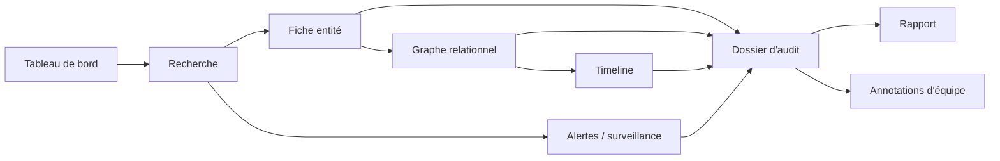

# VéloceREQ — Parcours utilisateurs prioritaires

## 1. Navigation générale

Principe directeur : **une seule respiration** — Recherche → Fiche → Graphe → Timeline → Dossier → Rapport. L'utilisateur ne doit jamais « perdre » son fil ; chaque écran propose d'ajouter l'élément consulté au dossier actif en un clic.

## 2. Parcours 1 — Investigation rapide (persona : enquêteur financier / syndic sous délai)

**Objectif** : en moins de 10 minutes, savoir si une entité ou une personne est liée à un réseau à risque.

1. **Connexion** → tableau de bord « mode investigation rapide » (par défaut si l'utilisateur a un profil syndic/enquêteur).
2. **Recherche** d'un NEQ ou d'un nom (barre de recherche omniprésente, raccourci clavier `/`).
3. Résultat → clic sur l'entité → **fiche entité** s'ouvre avec un **bandeau de score de risque** immédiatement visible (vert/jaune/rouge) et les 3 red flags les plus significatifs en résumé.
4. Clic « Voir le graphe » → **graphe relationnel** pré-filtré sur 2 degrés de séparation, avec les nœuds à risque déjà surlignés.
5. Survol d'un nœud suspect → carte contextuelle (mini-fiche + raison du flag).
6. Décision : soit l'utilisateur clôt l'investigation (rien à signaler, note rapide horodatée), soit il **escalade vers un dossier d'audit approfondi** (bouton unique « Ouvrir un dossier avec cette structure »).

Sortie : une conclusion en quelques minutes, traçable (recherche journalisée), avec option d'escalade sans reperdre le contexte déjà construit.

## 3. Parcours 2 — Audit approfondi (persona : CPA en due diligence, avocat en litige)

**Objectif** : produire un rapport d'audit structuré et opposable sur une structure de propriété complète.

1. **Créer un dossier** (nom, mandat, client, finalité déclarée — requis pour conformité).
2. **Recherche multi-critères** de l'entité racine (NEQ connu, ou recherche par administrateur si on part d'une personne).
3. **Fiche entité** → ajout au dossier. La fiche affiche : identité légale, statut, historique de forme juridique, adresses (actuelle + historique), administrateurs actuels/passés, actionnaires connus, documents sources liés.
4. **Expansion du graphe** : l'utilisateur étend progressivement (« Afficher les entités liées à cet administrateur », « Afficher les filiales à >50 % »), construisant son propre périmètre d'analyse plutôt que de subir un graphe déjà énorme.
5. **Détection de bénéficiaires ultimes (UBO)** : un panneau dédié calcule automatiquement les chaînes de contrôle ≥ 25 % (seuil LPLE) et affiche les personnes physiques en bout de chaîne, avec le chemin de calcul explicite (traçabilité du raisonnement, pas de boîte noire).
6. **Timeline** : bascule vue graphe → vue chronologique de la structure sélectionnée (constitutions, modifications d'administrateurs, changements d'adresse, dissolutions/reconstitutions) — permet de voir si une opération suspecte coïncide avec un événement externe (ex. jugement, avis de faillite).
7. **Red flags & scoring** : panneau listant chaque anomalie détectée, avec le mécanisme de détection expliqué en langage clair et un lien direct vers les entités/relations concernées dans le graphe.
8. **Annotation** : le professionnel documente ses observations directement sur les nœuds/relations concernés (notes horodatées, signées, éventuellement partagées avec un collègue du dossier).
9. **Comparaison temporelle** (optionnel) : « comparer la structure à la date X vs date Y » pour visualiser un changement précis (ex. avant/après une transaction suspecte).
10. **Génération du rapport** : sélection des sections (résumé exécutif, arbre de propriété, timeline, red flags, annexes de sources), génération PDF/Word avec pagination, table des matières, et **chaque affirmation reliée à sa source REQ (numéro d'avis, date)**.
11. **Export/partage** : le rapport et le dossier peuvent être partagés (lecture seule ou édition) avec un collègue du cabinet ; export des données brutes (CSV/JSON) pour analyse externe si requis.

## 4. Parcours 3 — Recherche inversée (persona : avocat cherchant tous les liens d'une personne)

1. Recherche par **nom de personne** (pas d'entité) → l'utilisateur obtient une liste de toutes les entités où cette personne apparaît comme administrateur/actionnaire, actuelles et passées, avec résolution d'identité affichée (score de confiance si plusieurs graphies).
2. Vue « profil de personne » agrégée : chronologie de tous les mandats, cartographie de coprésence (avec qui cette personne siège-t-elle récurremment ?).
3. Bouton « Construire le graphe de réseau de cette personne » → graphe centré-personne plutôt que centré-entité.

## 5. Parcours 4 — Surveillance continue / alertes (persona : conformité, enquêteur)

1. Depuis une fiche entité, une personne ou un dossier, activer **« Surveiller »**.
2. Configuration des déclencheurs (nouvel avis de modification, changement d'administrateur, dissolution, nouvelle entité liée à un administrateur surveillé, franchissement d'un seuil de score de risque).
3. Réception d'alertes dans le tableau de bord + notification (courriel/webhook API).
4. Clic sur une alerte → ouverture directe du delta (ce qui a changé) dans le contexte du dossier concerné.

## 6. Tableau de bord personnalisé par persona

| Persona | Widgets par défaut |
|---|---|
| Syndic / séquestre | Dossiers actifs sous délai, alertes de transferts d'actifs récents, entités liées au failli |
| CPA | Dossiers de mandat en cours, échéances de rapport, historique de recherches du client |
| Avocat | Dossiers de litige actifs, annotations en attente de validation, rapports générés |
| Conformité / enquêteur | Alertes de surveillance, entités à score de risque élevé récemment détectées, réseaux sous observation |

## 7. Bascule de mode

Un sélecteur persistant (coin supérieur) bascule entre **Investigation rapide** (UI dense, résumés, un clic vers l'essentiel) et **Audit approfondi** (UI complète, tous les panneaux, annotation et rapport actifs). Le contexte (entité/dossier en cours) est conservé lors de la bascule — aucun mode n'est un outil séparé.
