# VéloceREQ — Modèle de données relationnel

VéloceREQ combine une **base de graphe** (traversées de propriété/contrôle, performantes sur des milliers de sauts) et une **base relationnelle** (historique versionné, documents sources, dossiers, utilisateurs). Le schéma ci-dessous présente le modèle relationnel complet ; les entités `entite`, `personne` et `relation_*` sont répliquées comme nœuds/arêtes dans la base de graphe pour les besoins de traversée.

## 1. Diagramme entité-relation

```mermaid
erDiagram
    ENTITE ||--o{ ENTITE_HISTORIQUE : "versionne"
    ENTITE ||--o{ ADRESSE_LIEN : "possède"
    ENTITE ||--o{ RELATION_ADMINISTRATION : "administrée par"
    ENTITE ||--o{ RELATION_DETENTION : "détenue par (target)"
    ENTITE ||--o{ RELATION_DETENTION : "détient (source)"
    ENTITE ||--o{ RELATION_SUCCESSION : "prédécesseur"
    ENTITE ||--o{ RELATION_SUCCESSION : "successeur"
    ENTITE ||--o{ AVIS_REQ : "concerné par"
    ENTITE ||--o{ RED_FLAG : "détecte sur"

    PERSONNE ||--o{ RELATION_ADMINISTRATION : "administre"
    PERSONNE ||--o{ RELATION_DETENTION : "détient (personne)"
    PERSONNE ||--o{ ADRESSE_LIEN : "réside/déclare"
    PERSONNE ||--o{ RESOLUTION_IDENTITE : "candidat"

    ADRESSE ||--o{ ADRESSE_LIEN : "référencée par"

    AVIS_REQ ||--o{ RELATION_ADMINISTRATION : "source de"
    AVIS_REQ ||--o{ RELATION_DETENTION : "source de"
    AVIS_REQ ||--o{ ENTITE_HISTORIQUE : "source de"

    DOSSIER ||--o{ DOSSIER_ENTITE : "contient"
    DOSSIER ||--o{ DOSSIER_UTILISATEUR : "partagé avec"
    DOSSIER ||--o{ ANNOTATION : "regroupe"
    DOSSIER ||--o{ RAPPORT : "génère"
    DOSSIER ||--o{ SURVEILLANCE : "surveille"
    DOSSIER ||--o{ JOURNAL_ACCES : "trace"

    DOSSIER_ENTITE }o--|| ENTITE : "référence"
    ANNOTATION }o--|| UTILISATEUR : "auteur"
    ANNOTATION }o--o| ENTITE : "cible entité"
    ANNOTATION }o--o| PERSONNE : "cible personne"
    ANNOTATION }o--o| RELATION_DETENTION : "cible relation"

    CABINET ||--o{ UTILISATEUR : "emploie"
    CABINET ||--o{ DOSSIER : "possède"
    UTILISATEUR ||--o{ DOSSIER_UTILISATEUR : "accède"
    UTILISATEUR ||--o{ JOURNAL_ACCES : "génère"
    UTILISATEUR ||--o{ SURVEILLANCE : "configure"

    ENTITE {
        uuid id PK
        varchar neq UK
        varchar nom_legal
        varchar[] noms_anterieurs
        varchar forme_juridique
        varchar statut
        varchar code_naics
        date date_constitution
        date date_derniere_maj_req
        numeric score_risque
        timestamptz created_at
    }
    ENTITE_HISTORIQUE {
        uuid id PK
        uuid entite_id FK
        varchar champ_modifie
        text valeur_avant
        text valeur_apres
        date date_effective
        uuid avis_req_id FK
    }
    PERSONNE {
        uuid id PK
        varchar nom_complet
        varchar[] variantes_nom
        varchar type
        numeric score_confiance_identite
        timestamptz created_at
    }
    ADRESSE {
        uuid id PK
        text adresse_normalisee
        varchar code_postal
        geography geo_point
        int nb_entites_liees
    }
    ADRESSE_LIEN {
        uuid id PK
        uuid adresse_id FK
        uuid entite_id FK
        uuid personne_id FK
        varchar type_lien
        date depuis
        date jusqu_a
    }
    RELATION_ADMINISTRATION {
        uuid id PK
        uuid personne_id FK
        uuid entite_id FK
        varchar titre
        date depuis
        date jusqu_a
        uuid avis_req_id FK
    }
    RELATION_DETENTION {
        uuid id PK
        uuid entite_source_id FK
        uuid personne_source_id FK
        uuid entite_cible_id FK
        numeric pourcentage
        varchar type_titre
        date depuis
        date jusqu_a
        uuid avis_req_id FK
    }
    RELATION_SUCCESSION {
        uuid id PK
        uuid entite_predecesseur_id FK
        uuid entite_successeur_id FK
        varchar type_operation
        date date_operation
        uuid avis_req_id FK
    }
    AVIS_REQ {
        uuid id PK
        varchar numero_avis UK
        varchar type_avis
        date date_publication
        text url_source
        jsonb contenu_brut
    }
    RESOLUTION_IDENTITE {
        uuid id PK
        uuid personne_a_id FK
        uuid personne_b_id FK
        numeric score_similarite
        varchar statut
        uuid valide_par FK
        timestamptz valide_le
    }
    RED_FLAG {
        uuid id PK
        uuid entite_id FK
        varchar type_regle
        varchar severite
        numeric contribution_score
        jsonb elements_declencheurs
        varchar statut_revue
        uuid revu_par FK
        timestamptz created_at
    }
    CABINET {
        uuid id PK
        varchar nom
        varchar type_professionnel
        varchar plan
    }
    UTILISATEUR {
        uuid id PK
        uuid cabinet_id FK
        varchar courriel UK
        varchar role
        varchar persona_defaut
        boolean mfa_actif
    }
    DOSSIER {
        uuid id PK
        uuid cabinet_id FK
        varchar nom
        varchar client
        text finalite_declaree
        varchar mode
        varchar statut
        timestamptz created_at
    }
    DOSSIER_ENTITE {
        uuid id PK
        uuid dossier_id FK
        uuid entite_id FK
        timestamptz ajoute_le
    }
    DOSSIER_UTILISATEUR {
        uuid id PK
        uuid dossier_id FK
        uuid utilisateur_id FK
        varchar niveau_acces
    }
    ANNOTATION {
        uuid id PK
        uuid dossier_id FK
        uuid auteur_id FK
        uuid entite_cible_id FK
        uuid personne_cible_id FK
        uuid relation_cible_id FK
        text contenu
        timestamptz created_at
        timestamptz modifie_le
    }
    RAPPORT {
        uuid id PK
        uuid dossier_id FK
        varchar format
        jsonb sections_incluses
        text url_fichier
        uuid genere_par FK
        timestamptz genere_le
    }
    SURVEILLANCE {
        uuid id PK
        uuid dossier_id FK
        uuid utilisateur_id FK
        uuid entite_id FK
        uuid personne_id FK
        varchar[] declencheurs
        varchar canal_notification
    }
    JOURNAL_ACCES {
        uuid id PK
        uuid utilisateur_id FK
        uuid dossier_id FK
        varchar action
        text finalite
        jsonb contexte
        timestamptz horodate
    }
```

## 2. Notes de conception du modèle

- **Toute relation (`RELATION_*`) référence un `avis_req_id`** : c'est le principe de traçabilité absolue — aucune arête du graphe n'existe sans un document source officiel identifiable. Les données corroborantes (RDPRM, foncier) utilisent un champ `source_complementaire_id` distinct, jamais confondu avec `avis_req_id`.
- **`ENTITE_HISTORIQUE`** capture chaque changement champ par champ (pas seulement des snapshots complets), ce qui alimente directement la Timeline et le diff temporel (algorithmes doc 03 §4).
- **`RESOLUTION_IDENTITE`** est une table de *proposition*, jamais une fusion destructive : deux enregistrements `PERSONNE` distincts restent distincts en base tant qu'un utilisateur habilité n'a pas validé la fusion (`statut = 'validee'`). Ceci protège contre les faux rapprochements dans un contexte où l'erreur a des conséquences réputationnelles/légales.
- **`RED_FLAG`** stocke `elements_declencheurs` en JSONB — la liste exacte des entités/relations/dates qui ont fait déclencher la règle, pour que l'explication affichée à l'écran soit toujours reconstructible et vérifiable, pas un score « boîte noire ».
- **`DOSSIER` / `DOSSIER_ENTITE` / `DOSSIER_UTILISATEUR`** séparent la donnée publique partagée (le graphe REQ, mis en cache une fois pour tous les cabinets) du travail privé d'un cabinet (quelles entités il a regroupées, qui y a accès). C'est la frontière multi-tenant.
- **`JOURNAL_ACCES`** est append-only (pas d'UPDATE/DELETE applicatif) — table candidate à un stockage en append-only log ou à une politique de base interdisant la modification, pour la valeur probante en cas de contestation.
- **Score de risque dénormalisé sur `ENTITE.score_risque`** pour la performance de recherche/tri, mais toujours recalculable à partir de `RED_FLAG` (source de vérité = la table de flags, le champ dénormalisé est un cache invalidé à chaque nouvel avis ingéré touchant l'entité ou ses relations directes).

## 3. Base de graphe (miroir applicatif)

| Élément relationnel | Élément graphe |
|---|---|
| `ENTITE` | Nœud `:Entite {neq, nom_legal, score_risque, ...}` |
| `PERSONNE` | Nœud `:Personne {nom_complet, score_confiance_identite}` |
| `ADRESSE` | Nœud `:Adresse {adresse_normalisee}` |
| `RELATION_ADMINISTRATION` | Arête `:ADMINISTRE {titre, depuis, jusqu_a}` |
| `RELATION_DETENTION` | Arête `:DETIENT {pourcentage, depuis, jusqu_a}` |
| `RELATION_SUCCESSION` | Arête `:SUCCEDE_A {type_operation, date}` |
| `ADRESSE_LIEN` | Arête `:A_POUR_ADRESSE {type, depuis, jusqu_a}` |
| `RESOLUTION_IDENTITE (validee)` | Arête `:MEME_PERSONNE` (fusion logique en lecture) |

La synchronisation relationnel → graphe se fait par CDC (Change Data Capture) sur les tables sources, garantissant que le graphe reste un miroir dérivé et non une source de vérité parallèle divergente.
